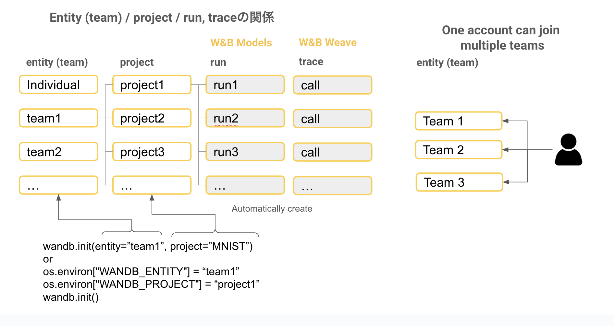
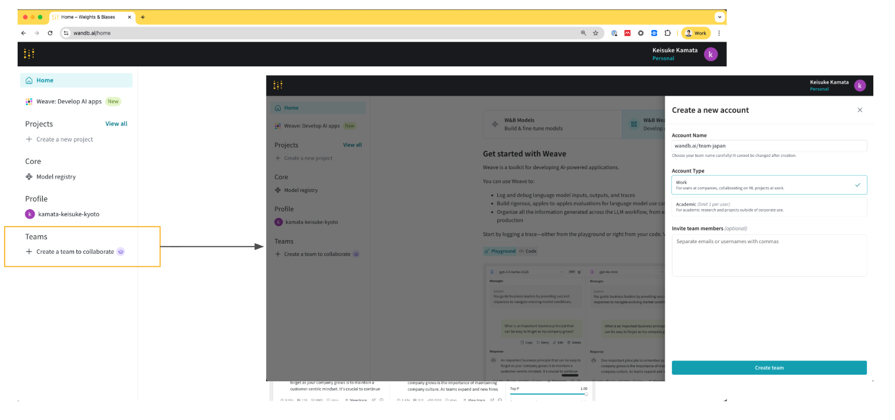
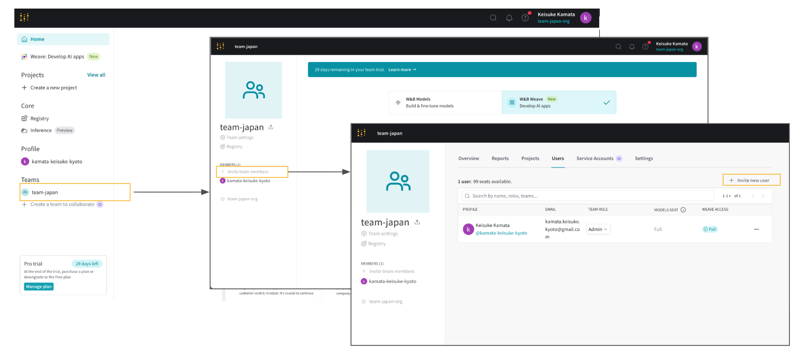

# Weave Introduction Handson

W&B Weave を使った Trace、評価、モニタリングのハンズオンです。

---

## Weaveを初めて聞いたという方へ

Weave をキャッチアップするためのアセット（ドキュメント、デモ動画、チュートリアル等）は[こちらのページ](https://wandbai.notion.site/W-B-Models-Weave-22dad8882177429ba1e9f0f05e7ceac3?source=copy_link)にまとめています。

## W&Bのアカウント発行・環境構築方法

[こちらのページ](https://wandbai.notion.site/W-B-Models-Weave-22dad8882177429ba1e9f0f05e7ceac3?source=copy_link)にW&Bのアカウント発行方法・環境構築方法を記載しています。instructionに従いながら、W&Bのアカウントを発行、API keyの取得を行なってください。Enterpriseのお客様で発行方法やWANDB_BASE_URLがわからない方は、担当のW&Bエンジニアまでご連絡ください。

Enterpriseの環境の方は、Adminの方のみTeamを作成できます。Adminの方に既存のTeam名を聞いてください。または新しいTeam作成を依頼してください。W&Bの無料アカウントでのteamの作り方は下記の通りです。

### Teamとは何か？

W&BはTeam, Project, Run(W&B Models), Trace (W&B Weave)という単位で実験を管理します。同じTeamに所属しているチームメートには自動的に実験結果が共有されます。ProjectはTeamの下の階層のフォルダのような管理単位です。Enterpriseの方は、Adminの方が複数のTeamを作れ、Free planの場合は1つしか作ることができません（複数のTeamに所属することはできます）。



### Team(entity)の作成と招待

Top pageの"Create a team to collaborate"をクリックし、teamを作成します。なお、Freeプランの場合、teamは一つしか作れません


参考：作成したteamのadminであれば、team memberを招待することができます



---

## このハンズオンで学べること

### 1. Tracing (トレーシング)
- `1_1_0` 基本的なトレーシング (@weave.op, Library Integration, エラートラッキング)
- `1_2_1` Agent SDK (ツール呼び出し, Threads)
- `1_2_2` マルチモーダル (画像, 音声, 動画, PDF, HTML)
- `1_3` 高度なトレーシング (Display Name, Kind/Color, Attributes, PII Redaction, Sampling)
- `1_4` Playground (UI機能の解説)

### 2. Asset Management (アセット管理)
- `2_1` プロンプト管理 (StringPrompt, MessagesPrompt, weave.ref)
- `2_2` データセット管理 (Dataset, publish, ref)
- `2_3` モデル管理 (weave.Model, 複数メソッド)
- `2_4` Scorer 作成 (カスタムScorer, Built-in Scorers)
- `2_5` アセットの呼び出し (weave.ref でロード)

### 3. Evaluation (評価・モニタリング)
- `3_1` オフライン評価 (weave.Evaluation, 複数Scorer)
- `3_2` EvaluationLogger (柔軟なバッチ評価)
- `3_3` オンラインフィードバック (Reaction, Note, カスタムフィードバック)
- `3_4` ガードレールとモニタリング (Scorer をガードレールとして使用)

---

## 環境構築・デモの前に確認してほしいこと

ハンズオンを始める前に、環境が正しくセットアップされているか確認してください。

### 確認手順

**1:依存関係をインストール:**

**uv を使う場合（推奨）:**
```bash
cd weave_introduction_handson
uv sync
```

pip を使う場合:
```bash
cd weave_introduction_handson
python -m venv .venv
source .venv/bin/activate  # Windows: .venv\Scripts\activate
pip install -r requirements.txt
```

**2:`.env` ファイルを作成（下記「環境変数の設定」を参照）**

**3:動作確認スクリプトを実行:**

**uv を使う場合:**
```bash
uv run python jp/1_1_0_basic_trace.py
```

pip を使う場合:
```bash
python jp/1_1_0_basic_trace.py
```

以下のメッセージが表示されれば成功です:
```
============================================================
Basic Trace Demo Complete!
============================================================
```

このメッセージが表示されない場合は、エラーメッセージを確認して環境変数や依存関係を見直してください。

---

---

## 環境構築

### セットアップ

**uv を使う場合（推奨）:**
```bash
cd weave_introduction_handson
uv sync
```

pip を使う場合:
```bash
cd weave_introduction_handson
python -m venv .venv
source .venv/bin/activate  # Windows: .venv\Scripts\activate
pip install -r requirements.txt
```

### 環境変数の設定

`.env` ファイルを作成:

```env
# 必須
WANDB_API_KEY=your_wandb_api_key
OPENAI_API_KEY=your_openai_api_key

# オプション
WANDB_ENTITY=your_team_name
WANDB_PROJECT=weave-handson

# Gemini を使う場合
GOOGLE_API_KEY=your_google_api_key

# Dedicated Cloud やオンプレミスを利用している場合
WANDB_BASE_URL=https://your-instance.wandb.io
```

**注意**: Dedicated Cloud やオンプレミス環境を利用している場合は、`WANDB_BASE_URL` に自社インスタンスの URL を設定してください。

### LLMプロバイダーの切り替え

`config.yaml` で OpenAI / Gemini を切り替えられます:

```yaml
# OpenAI を使う場合
provider: "openai"

# Gemini を使う場合
provider: "gemini"
```

### その他の便利な環境変数

詳細: [公式ドキュメント](https://docs.wandb.ai/weave/guides/core-types/env-vars)

| 変数名 | デフォルト | 説明 |
|--------|---------|------|
| `WEAVE_DISABLED` | false | トレーシング無効化 |
| `WEAVE_PRINT_CALL_LINK` | true | UI リンク出力 |
| `WEAVE_PARALLELISM` | 20 | 評価時の並列数 |

---

## ハンズオンの構成

```
jp/
├── config_loader.py         # LLM設定ローダー
├── 1_1_0_basic_trace.py     # 基本的なトレーシング
├── 1_2_1_agent_sdk.py       # Agent SDK
├── 1_2_2_multimodal.py      # マルチモーダル対応
├── 1_3_advanced_trace.py    # 高度なトレーシング
├── 1_4_playground.py        # Playground
├── 2_1_prompt.py            # プロンプト管理
├── 2_2_dataset.py           # データセット管理
├── 2_3_model.py             # モデル管理
├── 2_4_score.py             # Scorer 作成
├── 2_5_call.py              # アセットの呼び出し
├── 3_1_offline_evaluation.py    # オフライン評価
├── 3_2_evaluation_logger.py     # EvaluationLoggerによるオフライン評価体系の構築
├── 3_3_online_feedback.py       # オンラインフィードバック
└── 3_4_guardrail_monitoring.py  # ガードレール
```

---

## 実行方法

**uv を使う場合:**
```bash
uv run python jp/1_1_0_basic_trace.py
```

pip を使う場合:
```bash
python jp/1_1_0_basic_trace.py
```

---

## リソース

- **ドキュメント**: [W&B Weave Documentation](https://docs.wandb.ai/weave)
- **Built-in Scorers**: [Built-in Scorers](https://docs.wandb.ai/weave/guides/evaluation/builtin_scorers)
- **環境変数**: [Environment Variables](https://docs.wandb.ai/weave/guides/core-types/env-vars)
- **動画**:
  - [日本語チュートリアル](https://www.youtube.com/watch?v=Ua0Wx9fqhDo&t=295s)
  - [英語チュートリアル](https://www.youtube.com/watch?v=sJNjw6U2Tvg&t=522s)
