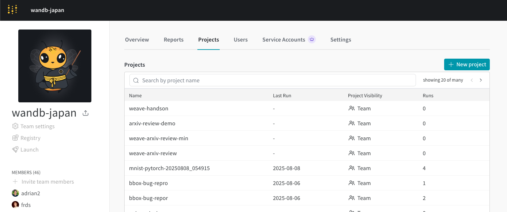

# W&B Weave Hands-on

[日本語版はこちら](README_JP.md)

## Overview (What this script accomplishes)
This repository contains hands-on materials for learning W&B Weave. You will experience W&B Weave, a framework for tracking, experimenting, evaluating, deploying, and improving LLM-based applications, as well as W&B Inference, the inference service provided by W&B.

For those who want to understand the complete picture of Weave, please refer to [this page](https://wandbai.notion.site/How-to-start-W-B-Models-and-Weave-4ebc2500493a47ad8307da1748dced57?source=copy_link). It contains links to [Weave demo (10 minutes)](https://www.youtube.com/watch?v=tRGoT1QV8VA) and [Weave documentation](https://wandb.me/weave).


## Environment Setup & Prerequisites

1. **W&B Account Creation & Environment Setup**
   
   [This page](https://wandbai.notion.site/W-B-Models-Weave-22dad8882177429ba1e9f0f05e7ceac3?source=copy_link) contains instructions for W&B account creation and environment setup. Please follow the instructions to create a W&B account and obtain an API key. Enterprise customers who are unsure about the issuance method or WANDB_BASE_URL should contact their assigned W&B engineer.

2. **W&B Inference Preparation**

   For LLM API inference, we use W&B Inference (β feature). Starting from 2025, W&B provides inference endpoints. Up to $5 is free to use, so we'll use this for the hands-on. W&B Inference documentation is [here](https://docs.wandb.ai/guides/inference/). A list of models available with W&B Inference is [here](https://wandb.ai/inference). To use W&B Inference, please create a project within an entity other than your personal entity. You will use that project for inference. Projects can be created from "New project" shown in the image below. In the case of the image below, the entity would be wandb-japan. Please note that inference cannot be used with personal entities (entities with account names like keisuke-kamata).

   

3. **Environment Setup**

   3.1 Using Google Colab
      - For Google Colab, please use the following link

   3.2 Local Execution
   - Python 3.8 or higher / [uv](https://github.com/astral-sh/uv) (recommended) or pip

      For local execution, please follow this workflow for environment setup:
   - **Clone the repository:**
      ```bash
      git clone https://github.com/olachinkei/wandb-handson.git
      cd wandb-handson/weave_introduction
      ```

   - **Environment setup using uv (recommended):**
      ```bash
      # Install uv if not already installed
      curl -LsSf https://astral.sh/uv/install.sh | sh

      # Create and activate virtual environment
      uv venv
      source .venv/bin/activate  # For Windows: .venv\Scripts\activate

      # Install dependencies
      uv pip install -r requirements.txt
      ```

      **Using pip:**
      ```bash
      python -m venv venv
      source venv/bin/activate  # For Windows: venv\Scripts\activate
      pip install -r requirements.txt
      ```
      
      **Launch Jupyter Lab and open the notebook:**
      ```bash
      jupyter lab weave_intro_notebook.ipynb
      ```

4. **Environment Variable Setup**
   Please obtain `WANDB_API_KEY` by referring to [this guide](https://docs.wandb.ai/support/find_api_key/).
   ```bash
   For Google Colab users, please enter this in the first cell.

   export WANDB_BASE_URL="https://api.wandb.ai" # Only for dedicated cloud or on-premises users
   export WANDB_API_KEY="your_wandb_api_key_here" 
   export WANDB_API_KEY_PUBLIC_CLOUD="your_public_cloud_wandb_api_key_here"  # Public cloud users use the same value as WANDB_API_KEY
   export GOOGLE_API_KEY="your_google_api_key" # optional if you want to try video
   ```
   **Note:** 
   - If you are using dedicated cloud or on-premises environment, please change `WANDB_BASE_URL` appropriately.
   - If using Azure OpenAI, set the environment variable `USE_AZURE_OPENAI=true`.

5. **Steps to Verify Before the Hands-on**

   Please confirm that you can implement the following sections in the jupyter notebook (or Google Colab):
   - 🪄 Installation and login of the `weave` library
   - Tracking function inputs and outputs
      - Custom function tracking
      - Tracking using integrations (W&B Inference, OpenAI, Anthropic, Mistral, etc.)

   If you have any questions, please contact W&B Kamata (keisuke.kamata@wandb.com).

## Resources

- **Documentation**: [W&B Weave Documentation](https://weave-docs.wandb.ai/)
- **Videos**:
  - [Japanese Tutorial](https://www.youtube.com/watch?v=Ua0Wx9fqhDo&t=295s)
  - [English Tutorial](https://www.youtube.com/watch?v=sJNjw6U2Tvg&t=522s)